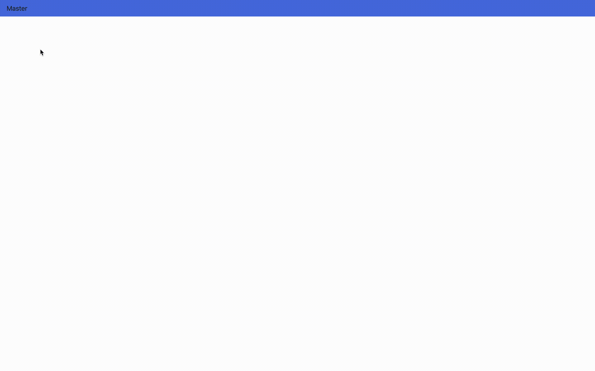

# react-nested-menu-selector

:bell: React component for Nested Menu with dropdown Selector.



## Installation

Install it from npm and import it in your root component

```bash
npm install --save react-nested-menu-selector
```

## Usage

```Javascript
import React from 'react';
import DropDownMenuSelect from 'react-nested-menu-selector';

const option = {
    placeholder: 'Master',
    options: [
        {
            value: 'Sample-Menu',
            label: 'Sample-Menu',
            hidden: false,
            logo: 'path_to_logo',
            options: [
                {
                    value: 'Sample-Sub-Menu',
                    label: 'Sample-Sub-Menu',
                    hidden: false,
                    logo: 'path_to_logo',
                    options: [
                        {
                            value: 'Sub-Menu-Option-1', (e.g. path to the URL to navigate to, will be handled via handleOnClick)
                            label: 'Sub-Menu-Option-1',
                            hidden: false,
                            logo: 'path_to_logo',
                        },
                        {
                            value: 'Sub-Menu-Option-2', (e.g. path to the URL to navigate to, will be handled via handleOnClick)
                            label: 'Sub-Menu-Option-2',
                            hidden: true,
                            logo: 'path_to_logo',
                        },
                    ],
                },
            ]
        }
    ]
};


function App() {
  return (
    <div>
      <DropDownMenuSelect
        values={option}
        handleOnClick = {this.handleOnClick}
      />
      <div>Test Application</div>
    </div>
  )
}

export default App;
```

## Props

| Name                | Type         | Description                                                             |
| -----------------   | ------------ | ----------------------------------------------------------------------- |
| **`values`**       | `{Array}`    | Values for the dropdown. Specify the options for users to select from. |                         |
| **`handleOnClick`** | `{function}` | Subscribe to change events.                                             |
| **`className`**     | `{String}`   | className to style the selector                                         |
